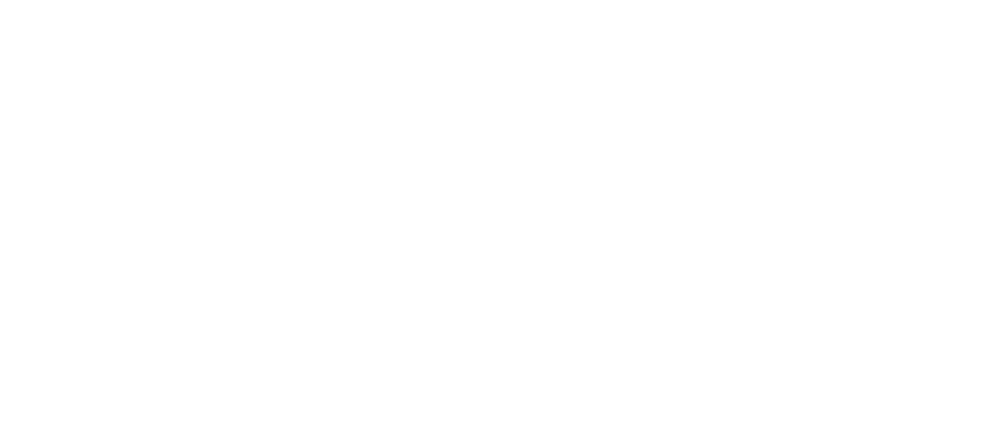

# What is Artificial Intelligence (AI)?

> "Artificial Intelligence (AI) is technology that enables computers to do things that would normally require human intelligence — understanding language, recognising images, making decisions, or learning from data — rather than simply executing a fixed set of instructions someone wrote in advance."

**Source:** Claude

---

> "AI (Artificial Intelligence) is a technology that enables computers and machines to perform tasks that usually require human intelligence, such as learning, problem-solving, understanding language, recognising images, and making decisions."

**Source:** ChatGPT

## Limitations and Considerations of AI

The following four points highlight the practical challenges involved in building and deploying effective AI systems:

- **Choose the problem wisely** — not every task is suited to AI. AI works best on problems with clear patterns and enough examples to learn from. Picking the wrong problem (too vague, too little data, or something that simple rules could solve just as well) can waste time and often lead to poor results.

- **Find the data** — AI models learn from examples, so you need enough relevant and representative data covering the situations the model will encounter. Without suitable data, there is nothing meaningful for the model to learn from.

- **Clean the data** — real-world data is often messy, with missing values, duplicates, errors, or inconsistent formatting. A model trained on poor-quality data will learn incorrect patterns, no matter how advanced the model is.

- **Train the model well** — the training process requires careful attention, including choosing the right settings, allowing enough training time, and testing performance. This helps avoid issues such as overfitting, where a model memorises training data instead of learning patterns that generalise to new, unseen data.

These points highlight that AI's biggest limitations are usually not because the algorithm is "not smart enough" — they are often related to choosing the right problem, having quality data, and carefully training the model. In practice, these areas require most of the effort in an AI project.

## Standalone AI Tools

   

AI-powered tools designed to work independently with minimal setup.

1. **ChatGPT**, **Claude** – Chatbots for answering questions, generating content, summarising information, brainstorming ideas, and assisting with coding and problem-solving.

2. **Otter.ai** – AI-powered transcription tool that converts speech into text for meetings, lectures, interviews, and conversations.

3. **Midjourney**, **DALL·E** – AI image generation tools that create images from natural language prompts.

## Integrated AI Tools

Built-in enhancements within particular pieces of software.

1. **Microsoft Copilot** – AI assistant integrated into Microsoft 365 applications such as Word, Excel, PowerPoint, and Teams.

2. **GitHub Copilot** – AI coding assistant integrated into development environments such as Visual Studio Code.

3. **Google Gemini** – AI assistant integrated into Google Workspace applications such as Gmail, Docs, Sheets, and Meet.

4. **Canva Magic Studio** – AI tools integrated into Canva for creating and editing designs.

